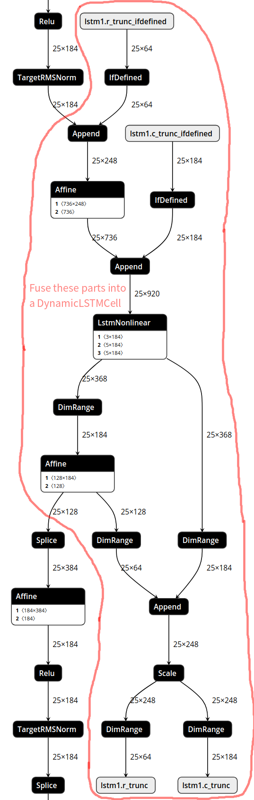
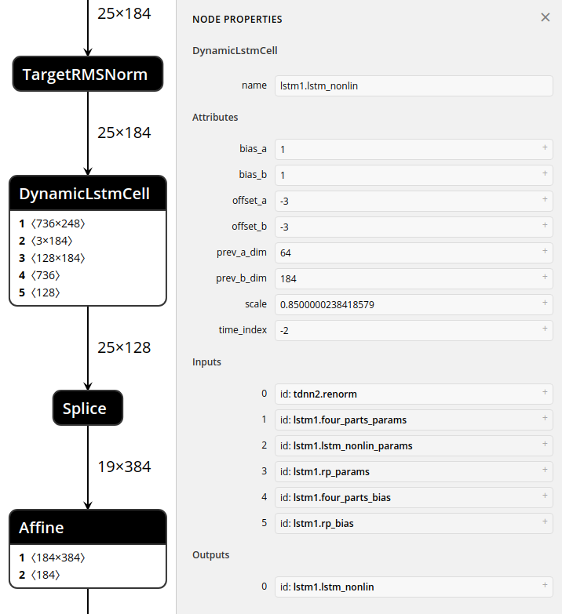

Dynamic LSTM
============

The DynamicLSTM in MACE is implemented for Kaldi's time delay RNN models.

The following pictures explain how to fuse components into a DynamicLSTMCell.

Before fusing:

After fusing:

For more details about LSTMNonlinear in Kaldi,
please refer to [LstmNonlinearComponent](http://kaldi-asr.org/doc/nnet-simple-component_8h_source.html#l02164)