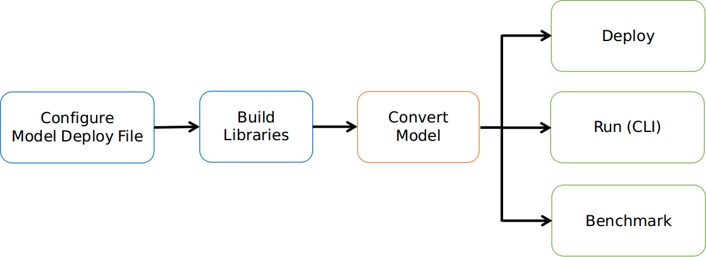

Introduction
============

MACE (Mobile AI Compute Engine) is a deep learning inference framework optimized for
mobile heterogeneous computing platforms. 
MACE provides tools and documents to help users to deploy deep learning models
to mobile phones, tablets, personal computers and IoT devices.

Architecture
-------------
The following figure shows the overall architecture.

.. image:: mace-arch.png
   :scale: 40 %
   :align: center

MACE Model
~~~~~~~~~~

MACE defines a customized model format which is similar to
Caffe2. The MACE model can be converted from exported models by TensorFlow, Caffe or ONNX Model.

MACE Interpreter
~~~~~~~~~~~~~~~~~

Mace Interpreter mainly parses the NN graph and manages the tensors in the graph.

Runtime
~~~~~~~

CPU/GPU/DSP runtime correspond to the Ops for different devices.

Workflow
--------
The following figure shows the basic work flow of MACE.

1. Configure model deployment file
~~~~~~~~~~~~~~~~~~~~~~~~~~~~~~~~~~~
Model deploy configuration file (.yml) describes the information of the model and library,
MACE will build the library based on the file.

2. Build libraries
~~~~~~~~~~~~~~~~~~
Build MACE dynamic or static libraries.

3. Convert model
~~~~~~~~~~~~~~~~~~
Convert TensorFlow, Caffe or ONNX model to MACE model.

4.1. Deploy
~~~~~~~~~~~~~~~~~~
Integrate the MACE library into your application and run with MACE API.

4.2. Run (CLI)
~~~~~~~~~~~~~~~~~~
MACE provides `mace_run` command line tool, which could be used to run model
and validate model correctness against original TensorFlow or Caffe results.

4.3. Benchmark
~~~~~~~~~~~~~~~~~~
MACE provides benchmark tool to get the Op level profiling result of the model.

简介
----

Mobile AI Compute Engine (MACE) 是一个专为移动端异构计算设备优化的深度学习前向预测框架。
MACE覆盖了常见的移动端计算设备（CPU，GPU和DSP），并且提供了完整的工具链和文档，用户借助MACE能够
很方便地在移动端部署深度学习模型。MACE已经在小米内部广泛使用并且被充分验证具有业界领先的性能和稳定性。

框架
----
下图描述了MACE的基本框架。

.. image:: mace-arch.png
   :scale: 40 %
   :align: center

MACE Model
~~~~~~~~~~~~~~~~~~

MACE定义了自有的模型格式（类似于Caffe2），通过MACE提供的工具可以将Caffe/TensorFlow/ONNX格式的模型
转为MACE模型。

MACE Interpreter
~~~~~~~~~~~~~~~~~~

MACE Interpreter主要负责解析运行神经网络图（DAG）并管理网络中的Tensors。

Runtime
~~~~~~~~~~~~~~~~~~

CPU/GPU/DSP Runtime对应于各个计算设备的算子实现。

使用流程
------------
下图描述了MACE使用的基本流程。

.. image:: mace-work-flow-zh.png
   :scale: 60 %
   :align: center

1. 配置模型部署文件(.yml)
~~~~~~~~~~~~~~~~~~~~~~~~~~
模型部署文件详细描述了需要部署的模型以及生成库的信息，MACE根据该文件最终生成对应的库文件。

2. 编译MACE库
~~~~~~~~~~~~~~~~~~
编译MACE的静态库或者动态库。

3. 转换模型
~~~~~~~~~~~~~~~~~~
将TensorFlow或者Caffe或者ONNX的模型转为MACE的模型。

4.1. 部署
~~~~~~~~~~~~~~~~~~
根据不同使用目的集成Build阶段生成的库文件，然后调用MACE相应的接口执行模型。

4.2. 命令行运行
~~~~~~~~~~~~~~~~~~
MACE提供了命令行工具，可以在命令行运行模型，可以用来测试模型运行时间，内存占用和正确性。

4.3. Benchmark
~~~~~~~~~~~~~~~~~~
MACE提供了命令行benchmark工具，可以细粒度的查看模型中所涉及的所有算子的运行时间。

